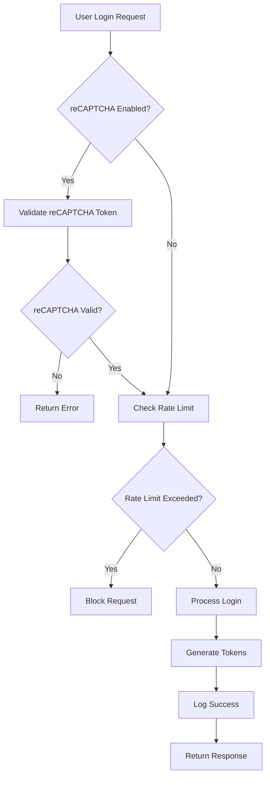
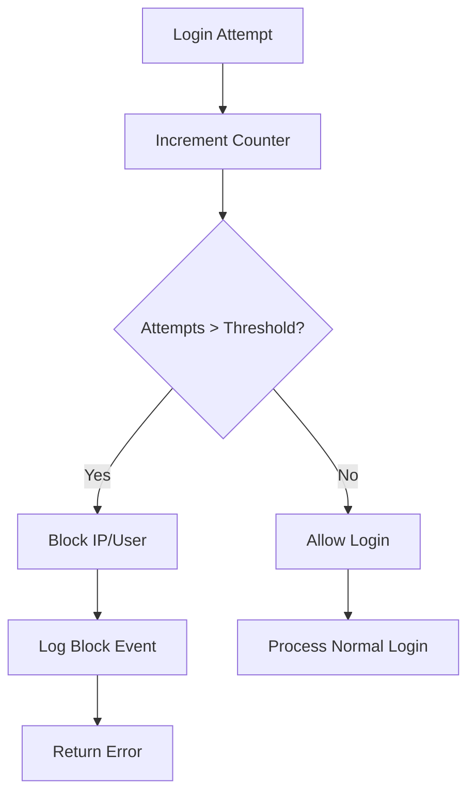

# Iteration 3 Product Requirements Document
## Integrasi reCAPTCHA & Observability

## 1. Product Overview
Iteration 3 berfokus pada peningkatan keamanan dan observability dari auth service melalui integrasi Google reCAPTCHA, rate limiting, dan comprehensive logging. Fitur-fitur ini akan memberikan perlindungan terhadap brute force attacks dan visibility yang lebih baik terhadap sistem.

- **Target**: Meningkatkan keamanan login dengan reCAPTCHA dan mencegah abuse melalui rate limiting
- **Pengguna**: Semua user yang melakukan login, admin yang memonitor sistem
- **Nilai**: Mencegah automated attacks, compliance dengan security best practices, better troubleshooting

## 2. Core Features

### 2.1 User Roles
| Role | Registration Method | Core Permissions |
|------|---------------------|------------------|
| End User | Email registration | Login dengan reCAPTCHA protection |
| Admin | System configuration | Monitor logs, configure reCAPTCHA settings |
| System | Internal service | Rate limiting enforcement, logging |

### 2.2 Feature Module
Authentication service dengan enhanced security dan observability:

1. **Login dengan reCAPTCHA**: Form login dengan Google reCAPTCHA v2/v3
2. **Rate Limiting Dashboard**: Monitoring failed login attempts
3. **Security Logs**: Structured logging untuk audit trail
4. **Error Tracking**: Comprehensive error catalog dengan correlation ID
5. **Performance Monitoring**: Response time dan throughput metrics

### 2.3 Page Details
| Page Name | Module Name | Feature description |
|-----------|-------------|---------------------|
| Login Page | reCAPTCHA Integration | Validasi Google reCAPTCHA siteverify API sebelum login |
| Security Dashboard | Rate Limiting | Monitor failed attempts, auto-block suspicious activity |
| System Logs | Structured Logging | Log semua authentication events dengan correlation ID |
| Error Handling | Error Catalog | Standardized error responses dengan proper error codes |
| API Monitoring | Performance Metrics | Track response time, success rate, error rate |

## 3. Core Process

### 3.1 Login Flow dengan reCAPTCHA


### 3.2 Rate Limiting Flow


## 4. User Interface Design

### 4.1 Design Style
- **Primary Color**: #1a73e8 (Google Blue) untuk reCAPTCHA integration
- **Secondary Color**: #34a853 (Google Green) untuk success states
- **Error Color**: #ea4335 (Google Red) untuk error states
- **Button Style**: Rounded corners dengan shadow untuk depth
- **Font**: System fonts untuk consistency
- **Layout**: Card-based dengan proper spacing
- **Icons**: Google Material Icons untuk familiarity

### 4.2 Page Design Overview
| Page Name | Module Name | UI Elements |
|-----------|-------------|-------------|
| Login Page | reCAPTCHA Widget | Google reCAPTCHA v2 checkbox atau v3 invisible, positioned below password field |
| Error Messages | User Feedback | Inline validation dengan color-coded messages, correlation ID display |
| Loading States | UX Feedback | Spinner dengan timeout handling untuk reCAPTCHA validation |

### 4.3 Responsiveness
- Mobile-first approach untuk reCAPTCHA widget
- Touch-friendly error messages
- Responsive rate limiting notifications
- Optimized untuk mobile authentication flow

## 5. Technical Requirements

### 5.1 reCAPTCHA Integration
- Google reCAPTCHA siteverify API integration
- Support untuk v2 dan v3
- Configurable secret key dan site key
- Timeout handling (5 seconds default)
- Fallback mechanism jika reCAPTCHA service down

### 5.2 Rate Limiting
- IP-based rate limiting: 5 attempts per 15 minutes
- User-based rate limiting: 10 attempts per hour
- Configurable thresholds
- Redis/memory storage untuk counters
- Auto-unblock setelah cooldown period

### 5.3 Observability
- Structured JSON logging dengan correlation ID
- Log levels: ERROR, WARN, INFO, DEBUG
- Performance metrics: response time, throughput
- Error tracking dengan stack traces
- Security audit logs untuk compliance

## 6. Configuration
Environment variables yang diperlukan:
```bash
# reCAPTCHA Configuration
RECAPTCHA_ENABLED=true
RECAPTCHA_SECRET=your-secret-key
RECAPTCHA_SITE_KEY=your-site-key
RECAPTCHA_SKIP=false
RECAPTCHA_TIMEOUT=5s

# Rate Limiting
RATE_LIMIT_ENABLED=true
RATE_LIMIT_IP_ATTEMPTS=5
RATE_LIMIT_IP_WINDOW=15m
RATE_LIMIT_USER_ATTEMPTS=10
RATE_LIMIT_USER_WINDOW=1h

# Logging
LOG_LEVEL=INFO
LOG_FORMAT=json
LOG_CORRELATION_ID_HEADER=X-Correlation-ID
```

## 7. Acceptance Criteria

### 7.1 reCAPTCHA Integration
- [ ] Login berhasil dengan valid reCAPTCHA token
- [ ] Login gagal dengan invalid reCAPTCHA token
- [ ] reCAPTCHA dapat di-disable untuk development
- [ ] Timeout handling bekerja dengan baik
- [ ] Error messages informatif untuk user

### 7.2 Rate Limiting
- [ ] Block setelah threshold attempts tercapai
- [ ] Auto-unblock setelah cooldown period
- [ ] Different limits untuk IP vs user
- [ ] Proper error responses dengan retry-after header
- [ ] Admin dapat melihat blocked users/IPs

### 7.3 Observability
- [ ] All requests memiliki correlation ID
- [ ] Structured logs untuk semua events
- [ ] Performance metrics tersedia
- [ ] Error tracking dengan proper categorization
- [ ] Security audit trail lengkap

## 8. Success Metrics
- **Security**: 0 successful brute force attacks
- **Performance**: <100ms additional latency untuk reCAPTCHA
- **Reliability**: 99.9% uptime untuk rate limiting service
- **Obs