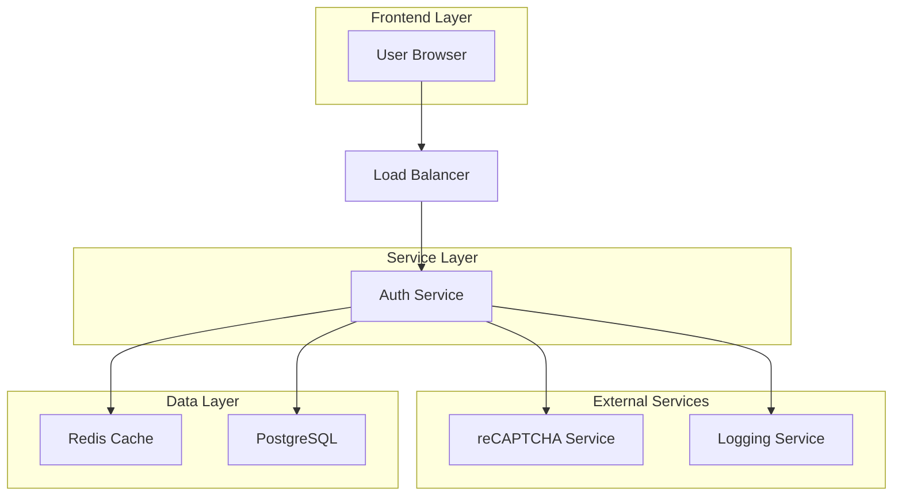
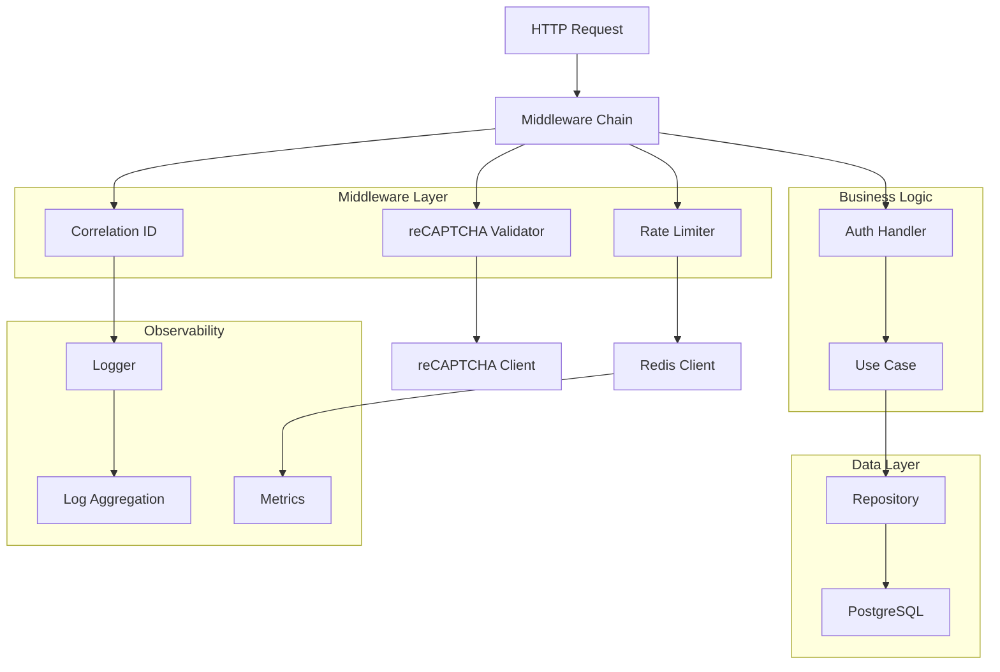
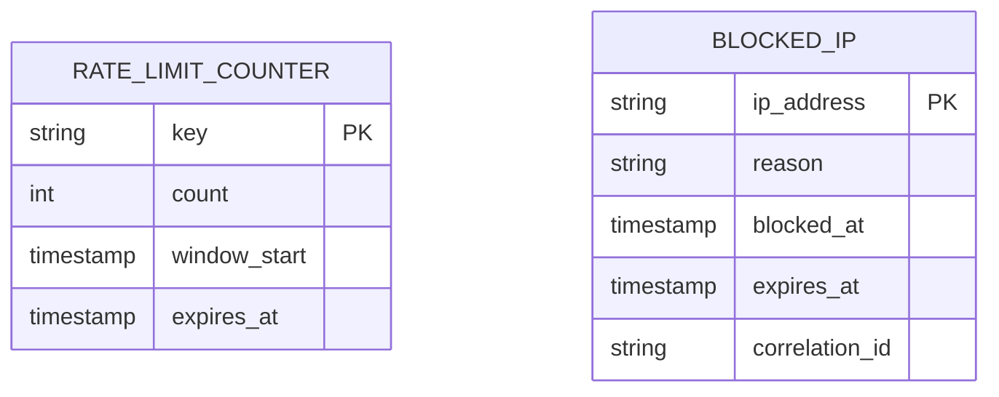

# Iteration 3 Technical Architecture Document
## Integrasi reCAPTCHA & Observability

## 1. Architecture Design



## 2. Technology Description

### Core Technologies
- **Backend**: Go 1.21+ dengan Gin framework
- **Database**: PostgreSQL 14+ untuk persistent storage
- **Cache**: Redis 7+ untuk rate limiting counters
- **External API**: Google reCAPTCHA siteverify API
- **Logging**: Structured JSON dengan correlation ID

### Dependencies
```go
// Core dependencies
github.com/gin-gonic/gin v1.9.1
github.com/go-redis/redis/v8 v8.11.5
github.com/sirupsen/logrus v1.9.3
github.com/google/uuid v1.3.0

// reCAPTCHA integration
golang.org/x/net v0.17.0 // untuk HTTP client dengan timeout
```

## 3. Route Definitions

| Route | Method | Purpose | Middleware |
|-------|--------|---------|------------|
| /v1/auth/login | POST | Authenticate user dengan reCAPTCHA | RateLimit, reCAPTCHA |
| /v1/auth/refresh | POST | Refresh access token | RateLimit |
| /v1/auth/logout | POST | Revoke tokens | Auth, RateLimit |
| /v1/auth/me | GET | Get current user | Auth |
| /health | GET | Health check | - |
| /metrics | GET | Prometheus metrics | - |

## 4. API Definitions

### 4.1 reCAPTCHA Validation
```
POST /v1/auth/login
```

Request dengan reCAPTCHA:
```json
{
  "email": "user@example.com",
  "password": "password123",
  "recaptcha_token": "03AGdBq25..."
}
```

Response Success:
```json
{
  "status": true,
  "message": "success",
  "data": {
    "access_token": "eyJhbGciOiJIUzI1NiIsInR5cCI6IkpXVCJ9...",
    "expires_in": 900
  }
}
```

Response Error (reCAPTCHA invalid):
```json
{
  "status": false,
  "message": "Invalid reCAPTCHA token",
  "data": null,
  "correlation_id": "550e8400-e29b-41d4-a716-446655440000"
}
```

### 4.2 Rate Limiting Headers
Response headers untuk rate limited requests:
```
X-RateLimit-Limit: 5
X-RateLimit-Remaining: 0
X-RateLimit-Reset: 1640995200
Retry-After: 900
```

## 5. Server Architecture



## 6. Data Model

### 6.1 Rate Limiting Schema


### 6.2 Redis Key Structure
```
rate_limit:ip:{ip_address}:{window} -> counter
rate_limit:user:{user_id}:{window} -> counter
blocked:ip:{ip_address} -> TTL
blocked:user:{user_id} -> TTL
```

## 7. Service Components

### 7.1 reCAPTCHA Service
```go
type RecaptchaService interface {
    VerifyToken(ctx context.Context, token string) (bool, error)
    IsEnabled() bool
}

type recaptchaService struct {
    secretKey string
    siteURL   string
    timeout   time.Duration
    enabled   bool
    skip      bool
}
```

### 7.2 Rate Limiting Service
```go
type RateLimitService interface {
    CheckLimit(ctx context.Context, key string, limit int, window time.Duration) (bool, error)
    Increment(ctx context.Context, key string, window time.Duration) error
    Block(ctx context.Context, key string, duration time.Duration, reason string) error
    IsBlocked(ctx context.Context, key string) (bool, error)
}

type rateLimitService struct {
    redisClient *redis.Client
    logger      *logrus.Logger
}
```

### 7.3 Logging Service
```go
type Logger interface {
    Info(ctx context.Context, message string, fields map[string]interface{})
    Error(ctx context.Context, message string, err error, fields map[string]interface{})
    Warn(ctx context.Context, message string, fields map[string]interface{})
    Debug(ctx context.Context, message string, fields map[string]interface{})
}

type structuredLogger struct {
    logger *logrus.Logger
}
```

## 8. Configuration

### 8.1 reCAPTCHA Configuration
```go
type RecaptchaConfig struct {
    Enabled      bool          `env:"RECAPTCHA_ENABLED" default:"true"`
    SecretKey    string        `env:"RECAPTCHA_SECRET" required:"true"`
    SiteKey      string        `env:"RECAPTCHA_SITE_KEY" required:"true"`
    Skip         bool          `env:"RECAPTCHA_SKIP" default:"false"`
    Timeout      time.Duration `env:"RECAPTCHA_TIMEOUT" default:"5s"`
    SiteVerifyURL string       `env:"RECAPTCHA_SITE_VERIFY_URL" default:"https://www.google.com/recaptcha/api/siteverify"`
}
```

### 8.2 Rate Limiting Configuration
```go
type RateLimitConfig struct {
    Enabled         bool          `env:"RATE_LIMIT_ENABLED" default:"true"`
    RedisURL        string        `env:"REDIS_URL" default:"redis://localhost:6379/0"`
    IPAttempts      int           `env:"RATE_LIMIT_IP_ATTEMPTS" default:"5"`
    IPWindow        time.Duration `env:"RATE_LIMIT_IP_WINDOW" default:"15m"`
    UserAttempts    int           `env:"RATE_LIMIT_USER_ATTEMPTS" default:"10"`
    UserWindow      time.Duration `env:"RATE_LIMIT_USER_WINDOW" default:"1h"`
    BlockDuration   time.Duration `env:"RATE_LIMIT_BLOCK_DURATION" default:"30m"`
}
```

### 8.3 Logging Configuration
```go
type LoggingConfig struct {
    Level             string `env:"LOG_LEVEL" default:"INFO"`
    Format            string `env:"LOG_FORMAT" default:"json"`
    CorrelationIDHeader string `env:"LOG_CORRELATION_ID_HEADER" default:"X-Correlation-ID"`
    EnableRequestLog  bool   `env:"LOG_ENABLE_REQUEST_LOG" default:"true"`
    EnableResponseLog bool   `env:"LOG_ENABLE_RESPONSE_LOG" default:"false"`
}
```

## 9. Error Handling

### 9.1 Error Catalog
```go
var (
    ErrRecaptchaInvalid     = errors.New("invalid recaptcha token")
    ErrRecaptchaTimeout     = errors.New("recaptcha verification timeout")
    ErrRecaptchaServiceDown = errors.New("recaptcha service unavailable")
    ErrRateLimitExceeded    = errors.New("rate limit exceeded")
    ErrIPBlocked           = errors.New("IP address blocked")
    ErrUserBlocked         = errors.New("user account blocked")
)
```

### 9.2 Error Response Format
```json
{
  "status": false,
  "message": "Rate limit exceeded",
  "data": null,
  "correlation_id": "550e8400-e29b-41d4-a716-446655440000",
  "error_code": "RATE_LIMIT_EXCEEDED",
  "retry_after": 900
}
```

## 10. Security Considerations

### 10.1 reCAPTCHA Security
- Secret key tidak pernah dikirim ke client
- Token validation di server-side
- Timeout untuk mencegah replay attacks
- Fallback mechanism jika service down

### 10.2 Rate Limiting Security
- Redis dengan authentication
- IP spoofing protection
- Distributed rate limiting untuk multiple instances
- Proper key expiration untuk mencegah memory leak

### 10.3 Logging Security
- Sanitization dari sensitive data (passwords, tokens)
- Correlation ID untuk traceability
- Proper log retention policy
- Secure log transport ke aggregation service

## 11. Performance Metrics

### 11.1 Key Performance Indicators
- **reCAPTCHA Response Time**: < 500ms (95th percentile)
- **Rate Limiting Check**: < 10ms (Redis latency)
- **Logging Overhead**: < 5ms per request
- **Error Rate**: < 0.1% untuk reCAPTCHA validation

### 11.2 Monitoring Endpoints
```
GET /metrics - Prometheus metrics
GET /health - Health check dengan dependency status
GET /debug/pprof - Go runtime profiling (development only)
```

## 12. Deployment Considerations

### 12.1 Infrastructure Requirements
- Redis cluster untuk high availability
- PostgreSQL dengan replication
- Load balancer dengan sticky sessions
- Monitoring stack (Prometheus, Grafana)

### 12.2 Environment Variables
Pastikan semua environment variables di-set dengan benar:
- `RECAPTCHA_SECRET` dan `RECAPTCHA_SITE_KEY`
- `REDIS_URL` untuk rate limiting
- `LOG_LEVEL` sesuai environment (development/production)
- Rate limiting thresholds yang sesuai

## 13. Testing Strategy

### 13.1 Unit Tests
- reCAPTCHA service dengan mock HTTP client
- Rate limiting service dengan mock Redis
- Logging service dengan output capture

### 13.2 Integration Tests
- End-to-end login flow dengan reCAPTCHA
- Rate limiting behavior dengan Redis
- Error scenarios dan timeout handling

### 13.3 Load Tests
- Concurrent login attempts
- Rate limiting performance
- Redis cluster behavior